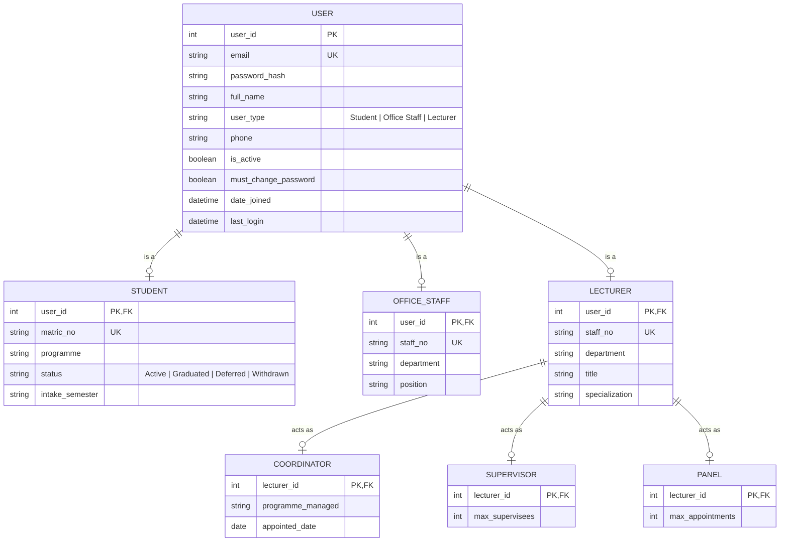

# ERD 01 — User & Role Hierarchy

Generalization/specialization (EER) model for every account that can log in.

```
USER  (superclass)
├── STUDENT
├── OFFICE STAFF
└── LECTURER
    ├── COORDINATOR   (overlapping)
    ├── SUPERVISOR    (overlapping)
    └── PANEL         (overlapping)
```

## Diagram



## Design notes

- **Shared PK = ISA link.** Each subtype's primary key is also a foreign key to its
  parent (`STUDENT.user_id -> USER.user_id`, `COORDINATOR.lecturer_id -> LECTURER.user_id`).
- **USER -> {Student, Office Staff, Lecturer}:** disjoint + total (every account is
  exactly one type).
- **LECTURER -> {Coordinator, Supervisor, Panel}:** overlapping + partial — a lecturer
  may hold several of these roles at once or none (supports FR-06, multiple roles).
- **Supervisor / Panel are profile/eligibility tables only.** The actual
  lecturer-to-student links (and per-semester workload counts for FR-23 / FR-29) live in
  the appointment entities modeled in later ERDs.

## Implementation status

**Implemented** (migration `accounts/0002`). The subtype tables exist as Django
OneToOne profile models in `accounts/models.py`, each sharing the parent's primary
key:

- `User` keeps the `role` discriminator + gains `phone`, `must_change_password`.
- `Student`, `OfficeStaff`, `Lecturer` link 1-to-1 to `User` (PK = FK).
- `Coordinator`, `Supervisor`, `Panel` link 1-to-1 to `Lecturer` (PK = FK).
- `department` / `student_id` / `staff_id` were removed from `User` and moved into
  the relevant profile tables; `User.to_public_dict()` reassembles the flat shape
  the frontend expects, so the login API contract is unchanged.

## Open items to reconcile

- `Programme Coordinator` is still a flat value in `User.Role` *and* now also a
  Lecturer specialization (`Coordinator` table). The seed creates a coordinator as a
  Lecturer **with** a Coordinator profile. If you want a single source of truth,
  decide whether the discriminator or the profile table is authoritative.
- `Supervisor` / `Panel` are currently thin (capacity only). The real
  lecturer↔student links land in the appointment ERDs (02+).
